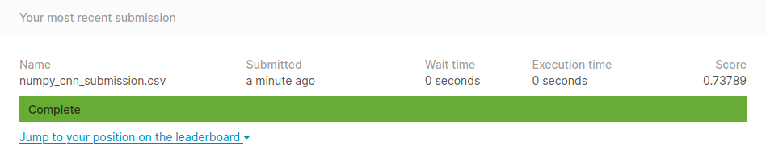
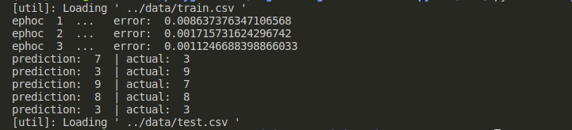

a simple Convolutional NeuralNetwork for recognizing MNIST hand written digits, written using `numpy` library. this repo builded for own interest and with help of VictorZhou's intro to cnn [tutorial](https://victorzhou.com/blog/intro-to-cnns-part-1/).

this simple cnn with `five (3,3) filers` got an `0.73` over `1.0` score on kaggle test by training on `40K` training example with `3 (SGD)ephocs`.

### Network structure

| |layer|
| :---: | :---: |
|0| Conv|
|1| MaxPool|
|2| Dense|

#### Data set

I used dataset from kaggle website,
 1. Go [here](https://www.kaggle.com/c/digit-recognizer/data) and download.
 2. Extract the files, and rename the folder to `data`
 3. move `data` folder to this repo.

#### Execution

* Go to `src` folder using `cd src`
* run `python main.py`

Note: Saving trained session of Network not implemented.  

#### sample output screen short

#### Lang\libraries\Tools
* `Python 3.8.3`
* `numpy`
* `pandas`

### Acknowledgments
* Victor Zhou [intro-to-cnns-part-1](https://victorzhou.com/blog/intro-to-cnns-part-1/) , [intro-to-cnns-part-2](https://victorzhou.com/blog/intro-to-cnns-part-2/)
* [yannlecun](http://yann.lecun.com/exdb/mnist/)
* [kaggle](https://www.kaggle.com/c/digit-recognizer)
* [Matt Mazur](https://mattmazur.com/2015/03/17/a-step-by-step-backpropagation-example/)
* [iamtrask](https://iamtrask.github.io/2015/07/12/basic-python-network/)